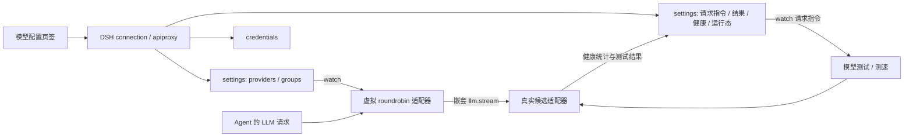

# Model Channel Manager / DeepSeek Harness / Cordis 审计

审计日期：2026-09-06。审计对象：当前 `@arcaneorion/dsh-model-channel-manager` 插件的全部业务源码、现有测试、文档，以及它依赖的 DSH/Cordis 接口。

## 1. 结论与证据范围

基础架构切分合理，正常条件下的主要路由路径能够工作。但当前实现没有守住三个核心保证：**超时必须能结束一次尝试；保存不得丢失或擅自改变配置；虚拟路由必须保持请求的能力与语义。** 这些问题已在隔离环境复现，不能用现有测试全绿推断故障转移与配置管理已经可靠。

按根因归并为 **19 项问题：9 项 P1、10 项 P2**。P1 指会阻塞核心请求、产生重复模型调用、丢失配置或改变请求语义，应优先修复；P2 指确定的功能、状态、统计或兼容性问题。优先级是本次工程判断，不是 CVSS 安全评分。

验证结果：

- 原有 **7 个测试文件全部通过**；两个业务文件语法检查通过。
- 额外执行 **31 个探针**：25 个问题现象、6 个正常行为对照。多个现象属于同一根因，因此不等于 25 个独立缺陷。
- Host 探针执行原始插件源码和真实的 Cordis、LLM、settings、timer 服务；只替换模型适配器和持久化存储。
- Client 探针执行原始 `client.js` 的加载、组件和事件函数；React hook、DOM 和 API 使用替身。这些结果是事件与提交参数验证，不是浏览器端到端验收。
- 未调用真实模型端点、未读取真实凭据、未修改用户运行配置，也未修改业务代码。没有验证正在运行实例的内存版本或实际上游费用。

审计开始时提交为 `7b83c3104e3ca7c0ae25f8d45c79945e5ccffdfb`。期间仓库外部新增 `19ed51df8a171884264714d775339778a9176b24`，把默认思考档位从 `medium` 改为 `max`；已核对差分并重跑受影响的 H06 及原有测试。本报告按当前提交行号引用。

当前目录是独立插件仓库。完整上层 DeepSeek harness、Cordis 内核的其他能力和已拆出的 model-selector-search 插件不在本次全面检查范围内；宿主部分只追踪本插件实际依赖的调用链。

| 本机已安装依赖 | 核对版本 |
| --- | --- |
| Cordis | 4.0.2 |
| Schemastery | 3.18.2 |
| cordis-plugin-timer | 1.1.4 |
| dsh-llm / dsh-settings / dsh-llm-pi-ai / dsh-host-apiproxy | 0.1.1-rc.2 |

完整版本路径、源码 SHA-256 和观测值见 [results.json](/home/arcaneorion/AI/AI-DSH/plugin/model-channel-manager/docs/audit/results.json)。

## 2. 架构与功能核对



这张图中最值得调整的是 `model-channel-health`：持久配置服务同时承担了命令投递、任务状态、监控存储和进程状态快照。F03、F11、F14、F15 都与这种混用有关。

| 功能 | 实现与验证结论 |
| --- | --- |
| Cordis 挂载、settings 延迟注入 | 已实现；路由新增、清空和注册清理通过 V05。后台工作的清理另有 F02。 |
| 供应商与模型编辑、凭据引用 | 基础字段编辑和 credential-ref 通道存在；保存并非无损，见 F04–F07。 |
| 上游模型发现、搜索、勾选差异 | configured/missing/stale 和保留顺序逻辑存在；真实端点未测；发现的容量信息在 client 中被丢弃。 |
| 供应商排序与重命名 | providerOrder 数组持久化方向合理；实际拖拽失败、preset 引用遗漏，见 F17/F18。 |
| 虚拟路由与组级配置快照 | prepareCall 的组快照通过 V04；能力和底层重放状态未完整保真，见 F08/F09。 |
| sticky / primary / round-robin | 三种串行选择行为通过 V01；并发 round-robin 不均分，见 F13。 |
| 首内容前故障转移 | 立即失败时能切换且只有一个 finish，通过 V02；真正挂起时的超时转移失败，见 F01。 |
| 中途失败终止 | 已输出内容后不会切换并拼接第二个模型，V03 通过。 |
| 重试、冷却、测速排序 | 代码路径存在；缺少请求总预算与完整熔断行为，自动测速及运行态发布另有 F14/F15。 |
| 单模型测试 | 能通过真实 LLM 服务执行假模型；请求可能重复执行、写入失败显示不正确，见 F03/F19。 |
| 健康统计 | 无交错写入时正常保存，通过 V06；交错丢记录、取消误计和时间窗失真，见 F11/F12。 |
| 旧配置迁移 | 有迁移哨兵和重试；迁移期间可覆盖用户刚保存的配置，见 F10。 |

## 3. 需要优先修复的问题

### F01 — P1：超时不能保证切换到下一候选

依据：[src/index.js:338](/home/arcaneorion/AI/AI-DSH/plugin/model-channel-manager/src/index.js:338)、[src/index.js:389](/home/arcaneorion/AI/AI-DSH/plugin/model-channel-manager/src/index.js:389)。

`Promise.race` 超时后进入 catch，却先 `await closeInner()`；它调用异步生成器的 `return()`。如果之前的 `next()` 仍在等待网络或数据，`return()` 会排在它后面。插件没有为该次候选创建可主动中止的 signal，超时只使 race 失败，并没有停止上游。

H02 将候选超时设为 15ms，80ms 后请求仍未结束，也没有调用第二候选；手动释放第一候选的等待后才发生切换。真实影响是慢请求可继续占住故障转移流程，上限取决于底层最终何时结束。

建议：每次尝试拥有独立 AbortController，与用户取消和插件生命周期联动；超时先中止上游，再执行有明确上限的清理。补上“上游 next 挂起”的验证，不能只断言 timeout 数值。

### F02 — P1：内层流与后台任务没有完整的生命周期所有者

依据：[src/index.js:310](/home/arcaneorion/AI/AI-DSH/plugin/model-channel-manager/src/index.js:310)、[src/index.js:506](/home/arcaneorion/AI/AI-DSH/plugin/model-channel-manager/src/index.js:506)、[src/index.js:655](/home/arcaneorion/AI/AI-DSH/plugin/model-channel-manager/src/index.js:655)。

三条流消费路径均手动调用 `inner.next()`，成功看到 finish 后返回，缺少覆盖成功、失败和消费者提前退出的 finally。清理函数只在 catch 中调用。DSH 的流包装层依赖迭代结束或 return 执行 finally，这一依赖被截断。

H01 中，同一假适配器直连会执行 finally，经过虚拟路由成功返回则没有执行。H11 中，卸载插件虽正确移除了路由和 settings 命名空间，正在等待的模型测试仍未取消；随后完成时继续尝试写已经卸载的命名空间。

可以确认的是清理协议被破坏、任务会越过卸载边界；实际残留的连接、监听器或内存量取决于具体适配器，未做长期资源测量。

建议：抽出统一的流消费器，始终关闭内层迭代器；后台测试和测速登记为插件拥有的任务，卸载需先停止接收、取消并等待任务结束，再移除结果通道。只有定时器使用 ctx.effect 不足以拥有整项异步工作。

### F03 — P1：两次并发测试可以触发五次模型调用

依据：[src/index.js:703](/home/arcaneorion/AI/AI-DSH/plugin/model-channel-manager/src/index.js:703)、[src/index.js:802](/home/arcaneorion/AI/AI-DSH/plugin/model-channel-manager/src/index.js:802)。

`testRequest` 是单一可覆盖字段，去重依据是另一次异步 settings 更新写入的 `lastTestHandledNonce`。排队中的旧确认可能和新的 testRequest 组成下一份提交快照，使 watcher 再次判断新请求未处理；同一请求没有同步的 in-flight 去重。

H05 使用真实 DSH settings 写队列，并发提交 nonce 101、102，实际执行 `one=1`、`two=4`，总共 5 次。结果最后都有记录，不代表执行次数正确。换成计费端点会产生额外调用。

Client 的 nonce 还采用 `Date.now() % 1000000000`，同毫秒操作可共用 ID，不能作为唯一任务身份。

建议：以唯一 requestId 建立独立任务记录，执行前原子认领；区分 queued/running/finished，并定义失败重试与重启恢复语义。至少要在同步执行路径维护已认领集合，不能只靠异步确认字段。允许重试和“同一请求重复执行”应有明确区分。

### F04 — P1：数据尚未加载时保存，会清空轮询组

依据：[src/client.js:1349](/home/arcaneorion/AI/AI-DSH/plugin/model-channel-manager/src/client.js:1349)、[src/client.js:1379](/home/arcaneorion/AI/AI-DSH/plugin/model-channel-manager/src/client.js:1379)。

初始 state/draft/channelsDraft 为 null，但保存按钮可点击。供应商分支会跳过，轮询组分支仍提交 `(channelsDraft || [])`。C04 直接执行初始化状态的保存回调，观测到 `groups: []`。

这把“尚未读取”与“用户明确清空”合并成同一个状态。建议设置明确的 loading/ready/error 状态，只有加载成功且草稿初始化完成后允许保存；保存中也应禁止重复提交。不能用空数组兜底表达未知配置。

### F05 — P1：刷新保留旧草稿，保存没有修订冲突保护

依据：[src/client.js:1183](/home/arcaneorion/AI/AI-DSH/plugin/model-channel-manager/src/client.js:1183)、[src/client.js:1329](/home/arcaneorion/AI/AI-DSH/plugin/model-channel-manager/src/client.js:1329)。

refresh 更新 state，却用 `prev || clone(...)` 保留已存在的 draft。save 随后整批 unset/set provider，且不发送宿主已经支持的 expectedRevision。

C03 中，刷新已经读到远端 `displayName='new elsewhere'`，草稿仍是 `old`，保存提交的也是 `old`，没有 revision。保留用户草稿可以是合理设计，但必须同时保留编辑基线并处理冲突；当前实现会让旧快照覆盖别处的新修改。仅修改轮询组也会重写供应商。

建议：保存读取时的 revision，只提交实际变更路径；没有本地修改时刷新应更新草稿，有本地修改时展示外部变更并提供合并/丢弃操作。不要用新 state 掩盖旧 draft 的基线。

### F06 — P1：“保存全部”会留下部分成功的跨命名空间状态

依据：[src/client.js:1329](/home/arcaneorion/AI/AI-DSH/plugin/model-channel-manager/src/client.js:1329)、[src/client.js:1359](/home/arcaneorion/AI/AI-DSH/plugin/model-channel-manager/src/client.js:1359)。

供应商 mutate 和组配置 update 并发执行，只由 `Promise.all` 汇总结果。一个成功、另一个失败时，没有事务、补偿或明确的部分成功状态。

C10 将供应商保存设为拒绝，轮询组仍成功提交了指向新 provider ID 的引用，界面只显示“保存失败”。真实宿主也以 namespace 为单位串行写入，不提供这两个独立 RPC 之间的原子性。

建议：有关联的变更由 host 统一验证并提交；如果当前宿主无法跨命名空间事务，重命名应按“创建新 provider → 更新全部引用 → 移除旧 provider”分阶段进行，并保留可恢复的部分成功状态。简单把 Promise.all 改成顺序 await 并不能解决所有失败窗口。

### F07 — P1：保存会改变合法配置的含义

依据：[src/client.js:1272](/home/arcaneorion/AI/AI-DSH/plugin/model-channel-manager/src/client.js:1272)、[src/client.js:1280](/home/arcaneorion/AI/AI-DSH/plugin/model-channel-manager/src/client.js:1280)。

确认了两个例子：

- C02：`reasoningEfforts: false` 保存后被删除。安装版 PiAiModelProfile 明确接受 false，含义是关闭 catalog 模型的推理；删除则重新继承，语义不同。
- C08：原本只写 `anthropic: {apiKeyEnv: ANTHROPIC_API_KEY}`、继承 catalog 协议的配置，被保存为 `api: openai-completions`。安装版 resolveRouteModels 优先使用显式 request.api，因此协议会被切换。

该例同时产生 `models: []`，但已核对宿主：空数组与缺省都继承 catalog，**不能把它列为模型列表被清空**。

建议：保留 undefined、false、null、显式值的不同含义；渲染默认值与持久化默认值分离。对未编辑字段做无损往返验证，尤其覆盖 catalog 继承、关闭推理和模型级覆盖。

### F08 — P1：虚拟能力声明与实际候选不一致，甚至丢图后仍报告成功

依据：[src/index.js:595](/home/arcaneorion/AI/AI-DSH/plugin/model-channel-manager/src/index.js:595)、[src/index.js:314](/home/arcaneorion/AI/AI-DSH/plugin/model-channel-manager/src/index.js:314)、[src/client.js:829](/home/arcaneorion/AI/AI-DSH/plugin/model-channel-manager/src/client.js:829)。

虚拟模型直接声明手填容量、模态和七个推理档位；候选选择没有按本次输入与能力过滤，原始参数直接传给候选。当前默认思考档位是 max。

- H06：非推理模型直连成功；经过默认启用推理的组后，宿主给请求补上 max，候选在真正 dispatch 前被拒，最后变成 CHANNEL_FULL_FAIL。原先 medium 也有同类问题，改变默认档位没有补上能力匹配。
- H14：虚拟模型声明 text+image，候选 first 只支持 text，second 支持 image。实际只调用 first，图片被宿主替换为 `[image omitted because this model accepts text only...]`；最终仍返回 stop，视觉候选没有被调用。

这不是单纯的可用率问题，而是用户请求的输入可能在“成功”路径被改变。默认 1M 上下文、128K 输出和所有新模型默认 vision/reasoning 也缺少来自候选的依据；模型发现返回的容量字段在 client 只保留 ID 后被丢弃。

建议：定义虚拟模型的能力保证，采用候选能力交集，或者按每次请求筛选满足模态、上下文、输出与推理档位的候选。选择前拒绝不兼容输入，避免进入宿主的静默图片降级路径；容量不能凭管理界面的固定默认值扩大。

### F10 — P1：后台旧配置迁移可覆盖用户刚保存的新配置

依据：[src/index.js:897](/home/arcaneorion/AI/AI-DSH/plugin/model-channel-manager/src/index.js:897)、[src/index.js:914](/home/arcaneorion/AI/AI-DSH/plugin/model-channel-manager/src/index.js:914)。

迁移只在函数入口检查 groups 为空，随后可能等待文件服务或文件读取；写入前不再检查配置和 revision，直接 replace 整个命名空间。

H15 暂缓旧文件读取，期间用户保存 new-user-group 与 providerOrder；释放读取后，组被替换为 legacy，providerOrder 也变成空数组。整个复现使用假文件服务，不触及用户文件。

建议：迁移提交前基于原 revision 做条件写入，只迁移仍未初始化的配置；读、解析、写入错误应分类，不应全部当成“无遗留配置”后写已迁移标记。

## 4. 其他确定的问题

### F09 — P2：嵌套路由丢失底层适配器的 replayState

依据：[src/index.js:314](/home/arcaneorion/AI/AI-DSH/plugin/model-channel-manager/src/index.js:314)；安装版 `dsh-llm/lib/index.js:1533` 的 forAdapter，准确包路径见 results.json。

宿主只允许同一 adapter identity 复用 assistant.source.replayState。虚拟 adapter 与真实 adapter 不同，内层调用将其移除。H09 中直连保留重放数据，虚拟调用丢失。

这证明虚拟路由不是语义完全透明的转发。对依赖重放数据的推理签名、连续请求状态等协议可能产生影响；本次没有对这些真实端点验证具体报错或缓存损失，因此不作定量结论。

建议：与宿主一起定义委托适配器的来源和重放状态归属，保留可验证的真实 provider/model 身份；切换不兼容候选时明确降级。不要简单绕过宿主检查，把某个 provider 的不透明状态转交另一 provider。

### F11 — P2：其他 settings 更新会抹掉尚未刷盘的健康记录

依据：[src/index.js:265](/home/arcaneorion/AI/AI-DSH/plugin/model-channel-manager/src/index.js:265)、[src/index.js:802](/home/arcaneorion/AI/AI-DSH/plugin/model-channel-manager/src/index.js:802)。

recordHealth 先修改内存、2 秒后批量写入；healthScope.watch 对这个命名空间的每次更新都用 next.records 覆盖内存。修改 testResults、请求确认或测速结果时，next.records 可能仍是旧快照。

H03：一次成功请求后立刻更新无关的 testResults，2 秒后记录为 0；对照 V06 不插入更新则保存 1 条。建议把未提交事件放在独立队列，提交成功才移出；控制字段的更新不能替换未提交监控数据。

### F12 — P2：健康统计的取消、时间窗与保留口径不一致

依据：[src/index.js:363](/home/arcaneorion/AI/AI-DSH/plugin/model-channel-manager/src/index.js:363)、[src/index.js:273](/home/arcaneorion/AI/AI-DSH/plugin/model-channel-manager/src/index.js:273)、[src/client.js:953](/home/arcaneorion/AI/AI-DSH/plugin/model-channel-manager/src/client.js:953)。

H04 中用户取消虚拟请求仍记为 `ok:false/code:ABORTED`。拦截器的取消过滤没有覆盖引擎自行记账路径。

C09 中 30 天前的事件仍被“近 7 天”计入，因为该选项 cutoff=0。Host 只在同一个 provider 新增事件时清理过期记录，长时间未调用的 provider 不会自动过期。

此外，实际是**每个 provider 共用最近 300 条**，不是 README 的“每组 2000 条”，也不是 7 天全量。一个热门模型可挤掉同 provider 其他模型的历史；每分钟一次调用时，300 条只能覆盖约 5 小时。Host 聚合的失败记录 TTFT 也会进入分子，而分母仅用成功次数。

建议：所有路径共用一次结果分类；以 kind 和取消来源区分中止与故障；查询时严格过滤时间窗。若使用截断样本，页面和可靠性算法必须明确样本口径；要提供 7 天汇总，可保留按时间桶聚合的数据。

### F13 — P2：round-robin 只在串行调用下均分

依据：[src/index.js:408](/home/arcaneorion/AI/AI-DSH/plugin/model-channel-manager/src/index.js:408)、[src/index.js:448](/home/arcaneorion/AI/AI-DSH/plugin/model-channel-manager/src/index.js:448)。

请求开始时读取共享 currentIndex，成功结束后才推进。H13 中两个并发请求都选择 first；V01 的串行请求则正确得到 first/second/first。

建议：在选择时原子预留轮询位置，再单独处理失败反馈；sticky 与 round-robin 使用不同的状态推进规则。若只打算支持完成后轮转，应修改“轮询均分”的产品表述。

### F14 — P2：自动测速开关不触发自动测速，完成后的运行态未及时发布

依据：[src/client.js:930](/home/arcaneorion/AI/AI-DSH/plugin/model-channel-manager/src/client.js:930)、[src/index.js:885](/home/arcaneorion/AI/AI-DSH/plugin/model-channel-manager/src/index.js:885)、[src/index.js:576](/home/arcaneorion/AI/AI-DSH/plugin/model-channel-manager/src/index.js:576)。

UI 只修改 enabled；boot 需要 enabled 与 onFirstUse 同时为真，普通请求和配置 watcher 都没有自动测速入口。H07 开启 enabled 后，启动与首次请求均没有测速结果。手动测速可以执行，但 enabled=false 时测速结果不会参与 orderedCandidates 的排名。

H10 中两候选测速失败，结果已保存，持久运行态仍为 `cooldowns=[]/lastSpeedTestAt=0`；原因是先 persist，再设置冷却、时间和完成事件。后续其他健康写入可能补上，单独完成一次测速则不保证发布。

建议：明确区分“自动发探针”和“使用测速排序”，定义首次使用/过期/手动触发条件；完成状态修改后统一提交，client 按任务终态展示结果，而不只显示“已触发”。

### F15 — P2：测试的超时与客户端等待期限不一致

依据：[src/index.js:519](/home/arcaneorion/AI/AI-DSH/plugin/model-channel-manager/src/index.js:519)、[src/index.js:670](/home/arcaneorion/AI/AI-DSH/plugin/model-channel-manager/src/index.js:670)、[src/client.js:470](/home/arcaneorion/AI/AI-DSH/plugin/model-channel-manager/src/client.js:470)。

测速与单模型测试每读一个 chunk 都重新启动完整 timeout。H12 中 timeoutMs=40，模型每 20ms 输出一次，84ms 后仍成功：这里限制的是单次等待，不是总耗时。

单模型测试同样每 chunk 重置 60s，而 client 按约 66s 的轮询次数放弃。持续输出的合法请求可能尚未结束，client 已显示超时，host 继续运行；网络请求自身耗时还会把实际轮询等待拉得更长。文本与 reasoning 也只在完成后截断，接收期间没有对应内存上限。

建议：分别定义首响应、空闲与任务总期限；服务端持有明确 deadline，客户端等待任务状态。取消轮询应能取消对应任务或明确表示仅停止等待。只需保留 2000 字的结果应在接收时限制保留量。

### F16 — P2：配置接受成功与实际可用路由不一致

依据：[src/index.js:8](/home/arcaneorion/AI/AI-DSH/plugin/model-channel-manager/src/index.js:8)、[src/index.js:64](/home/arcaneorion/AI/AI-DSH/plugin/model-channel-manager/src/index.js:64)。

schema 基本只声明 groups[].id 字符串，其余依靠 loose 与 normalizeConfig 兜底。非法 ID、重复 ID 会被 continue 丢弃；其他配置可被默认值悄悄替换。

H08 保存含一个非法 ID、两个重复 ID 的配置成功，settings 中有 3 组，实际只有 1 条路由。界面虽然能提示部分非法 ID，仍允许保存，而且没有重复 ID 的同等约束。

建议：把 ID、唯一性、候选形状、策略、数值范围和自引用检查移入 schema/注册时 validate，拒绝无效写入。迁移时的宽容归一化与用户正常编辑时的验证应分开；目录未列出某模型不应自动等同于不可路由。

### F17 — P2：供应商改名漏掉 activePreset 的候选

依据：[src/client.js:1152](/home/arcaneorion/AI/AI-DSH/plugin/model-channel-manager/src/client.js:1152)、[src/index.js:152](/home/arcaneorion/AI/AI-DSH/plugin/model-channel-manager/src/index.js:152)。

renameProviderInChannels 只改主 candidates，宿主却优先使用 activePreset.candidates。C05 中主候选已变为 renamed，活动 preset 仍指向 p。删除旧 provider 后，该组仍会访问旧 ID。

建议：建立统一的引用遍历与重命名操作，覆盖主候选、全部 presets 及其他受支持引用，并与 F06 的保存提交语义一起修复。

### F18 — P2：供应商拖拽直接抛 ReferenceError

依据：[src/client.js:602](/home/arcaneorion/AI/AI-DSH/plugin/model-channel-manager/src/client.js:602)。

map 参数为 `{name, p, realIdx}`，onDragStart 却使用不存在的 idx，且首次引用位于 try 外。C01 触发真实事件回调得到 `ReferenceError: idx is not defined`。因此即使 providerOrder 的存储方案正确，用户也无法完成该拖拽操作。

建议：统一使用 realIdx，并验证正常列表与过滤列表中的真实拖拽事件；纯数组重排测试不能覆盖这个入口。

### F19 — P2：测试/测速忽略 RPC 业务错误信封

依据：[src/client.js:498](/home/arcaneorion/AI/AI-DSH/plugin/model-channel-manager/src/client.js:498)、[src/client.js:856](/home/arcaneorion/AI/AI-DSH/plugin/model-channel-manager/src/client.js:856)。

这两条路径把 Promise resolve 当作成功，没有像 save 一样检查 `result.ok`。C06/C07 返回明确的 `ok:false`，测试仍显示 running 并轮询，测速显示 sent。用户最终可能收到误导性的“host 未处理、需要重启”提示。

建议：统一封装 RPC 解包与错误分类，业务错误立即展示；保留可识别的错误码，只对可以重试的传输错误做有限重试。

## 5. 设计评价与调整建议

### 5.1 应保留的设计

Host/client 分离、复用 DSH 现有 connection/settings/credentials、没有另起 HTTP 转发服务，这些选择减少了重复实现和部署对象。providerOrder 用数组表达顺序也符合持久化数据语义。

中途失败后停止切换是必要的，当前 V03 已验证；组配置的 prepareCall 快照 V04 也成立；路由/namespace 注册的 Cordis effect 清理 V05 成立。改造时应保住这些正常行为。

### 5.2 从基本要求推导需要分开的状态

| 基本要求 | 推荐职责归属 | 当前主要偏差 |
| --- | --- | --- |
| 配置由用户明确修改，不能丢失其他修改 | 配置服务、草稿 revision、路径差异提交 | 全量重写、未知状态当空值、跨 namespace 部分成功 |
| 一次按钮操作对应一个可观察任务 | 独立任务控制服务或具有原子认领的任务表 | 单槽 settings 字段 + 异步 nonce 确认 |
| 每次模型请求必须能结束并释放资源 | 一次尝试的 controller、deadline、finally、任务所有者 | race 结束与上游结束脱节 |
| 虚拟模型兑现声明的输入与能力 | 能力解析、候选筛选、真实来源记录 | 手填能力直接宣称、忽略 replayState 所有权 |
| 统计是对实际事件的可复核聚合 | 追加事件/时间桶、统一结果分类 | settings 整体快照覆盖、样本截断被称为全量 |

不需要为了这些职责立刻拆成大量 Cordis 包。可以先在当前插件内拆出可直接测试的模块，再把有独立宿主/客户端消费者的任务控制或监控能力提升为正式 service。

### 5.3 故障转移需要总预算和错误分类

当前一次全失败的请求，理论上会执行 `2 × N × (R + 1)` 次候选尝试；N 是候选数，R 是每候选重试次数。默认 R=2，即最多 6N 次，尚未计算宿主上层可能的再次重试。全部候选在冷却时仍允许立即探测，全失败后又清冷却，不能把它视为完整的熔断器。

应按错误类型处理：认证、未知模型、能力不支持等配置错误不应重复退避调用；临时限流/网络错误才进入有限重试。定义整次请求 deadline、尝试数预算及统一的取消边界；全部冷却时应限制半开探测数量。此处是基于当前控制流的设计建议，不是对真实提供商的压测结论。

### 5.4 虚拟路由还需要明确记录实际来源

一次虚拟请求可能尝试多个真实 provider/model，但当前健康事件缺少 requestId/attemptId/group 的统一关联；runtime.events 的零散信息不足以重建一次完整请求。应能够关联：虚拟请求 → 候选尝试 → 失败原因 → 最终真实模型 → 取消/完成。

这种来源信息也应该服务能力解释和 replayState 归属，避免在虚拟层只记录一个组 ID、把真实协议差异隐藏到内层。

### 5.5 前端表单需要保留配置语义

schema 是字段含义的权威，UI 应表达“继承 / 显式关闭 / 显式值”，而不是在保存时猜默认值。当前客户端 1414 行同时放样式、多个页面、RPC、清洗和保存逻辑，分支间已经出现处理不一致。可先提取共享 RPC 客户端、无损编辑模型和提交状态机，再整理组件。

“所有 provider 都默认 vision、所有新模型 1M/128K、所有组提供七档思考”不能作为通用能力判断。兼容参数应以协商到的协议和运行时 schema 为依据；用户主动覆写应清楚可见。

## 6. 测试与文档审计

现有测试多数是字符串/正则检查或复制一份业务逻辑：例如 panel-search 自己实现过滤器，p0-p1-fixes 自己构造 guardMs，provider-order-persistence 复制 settings 的 merge/patch。它们能验证示例算法，却不能证明当前事件入口和异步调用链正确。`idx` 错误、重复请求与健康丢写正好绕过了这些测试。

另外，package.json 没有 test script，也没声明测试使用的 yaml；本次 yaml 实际从用户另一个项目的 `.pnpm/yaml@2.9.0` 解析。adapter-contract 的安装包检查还依赖绝对目录，找不到时跳过。干净环境的可重复测试尚不完整。

建议优先建设三层证据：

1. 直接导入真实业务模块的行为测试，删除复制实现的断言；覆盖当前报告触发条件。
2. 真实 Cordis/LLM/settings 组合、假模型与内存/临时文件存储；覆盖并发、热更新、取消与卸载。当前审计探针已提供起点，但手工 ctx.plugin 组合仍不等于产品装配验收。
3. 通过真实 Loader/profile 和浏览器运行：验证发现模型、保存、拖拽、重命名、失败信封，以及测试任务的终态显示。外部模型调用可继续用受控假端点，真实端点只做另行安排的协议验证。

文档需要一起更新：

- README 说健康“每组 2000 条、7 天”，实现是每 provider 300 条，而且有 F12 的过期问题。
- README 的每次测试弹窗与实际“全局测试参数、直接发起”流程不同；保存 provider 实际用 mutate，部分数据通道描述仍写 update。
- DEVELOPMENT-EXPERIENCE 的 compat“只有两项有效”与本机 rc.2 不符；安装版确实公开 20 项，但 `sendSessionAffinityHeaders` 仍属于 withhold，不能泛称上游库全部开关都可用。
- 本机安装版 apiproxy 的 settings.describe 返回已注册命名空间，settingsWrite 没有 README 所述 exposedNamespaces 白名单。因此本次没有把“未打白名单补丁”列为缺陷；是否需要补丁必须对应具体宿主版本。
- README 对 prepareCall 的修复已经落到代码，并通过本次真实调用验证，不应重复列为未修问题。

## 7. 建议修复顺序与验收

| 阶段 | 优先处理 | 必须观察到的验收结果 |
| --- | --- | --- |
| 1 | F01/F02/F03：流与任务生命周期 | 挂起候选按 deadline 取消并切换；成功和提前退出都清理；卸载后无后台写入；两个 requestId 只执行两项任务。 |
| 2 | F04–F07/F10：配置写入 | 加载前不能提交；旧 revision 被拒绝；关联改名失败不留下悬空引用；false/继承协议无损往返；迁移不覆盖新配置。 |
| 3 | F08/F09/F13：路由语义 | 图片始终交给支持图片的候选；不支持的推理档位不会被强行下发；重放状态来源清楚；并发轮询符合声明的分配策略。 |
| 4 | F11/F12/F14/F15：健康与测速 | 交错写入不丢事件；取消不污染失败率；7 天窗口正确；自动测速实际触发；完成状态与总超时可观察。 |
| 5 | F16–F19、测试与文档 | 非法配置写入被拒绝；全部候选引用同步；真实拖拽可用；业务错误立即显示；干净安装环境能运行测试。 |

## 8. 复核材料与执行方式

- [Host 运行时探针](/home/arcaneorion/AI/AI-DSH/plugin/model-channel-manager/docs/audit/runtime-probes.mjs)：H01–H15 为问题场景，V01–V06 为正常对照。
- [Client 事件探针](/home/arcaneorion/AI/AI-DSH/plugin/model-channel-manager/docs/audit/client-probes.cjs)：C01–C10。
- [完整观测 JSON](/home/arcaneorion/AI/AI-DSH/plugin/model-channel-manager/docs/audit/results.json)：包含版本、源码摘要和每项实际输出。

```sh
node --test tests/*.test.cjs
node --check src/index.js
node --check src/client.js
node docs/audit/runtime-probes.mjs /path/to/installed/node_modules/.pnpm
node docs/audit/client-probes.cjs
```

Host 命令可在路径后追加逗号分隔的探针 ID，Client 命令可直接追加 ID。探针用于观察缺陷，`issue:true` 表示问题复现，退出码 0 不表示产品已经修复；正常对照使用断言验证。脚本不会连接真实模型或读取用户 settings。

本次交付是审计报告和复核材料，业务实现保持未修改。真实网络故障、上游协议互操作、浏览器完整交互、长时间负载和跨进程重启仍需在修复阶段通过对应环境验证。
